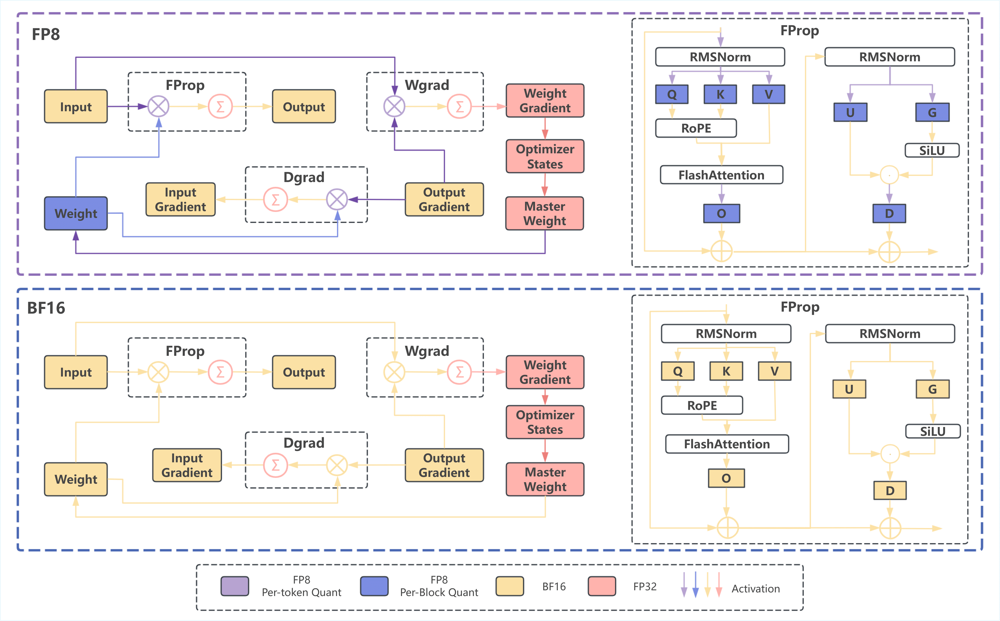

# InfiR2
[中文版](./README_CN.md)

<p align="center">
  <b>InfiR2: A Comprehensive FP8 Training Recipe for Reasoning-Enhanced Language Models</b>
</p>

<p align="center">
  <a href="https://scholar.google.com/citations?hl=zh-CN&user=1LA3TSAAAAAJ">Wenjun Wang*</a>,
  <a href="https://scholar.google.com/citations?user=VRlUiqQAAAAJ">Shuo Cai*</a>,
  <a href="https://scholar.google.com/citations?user=I6SAtGMAAAAJ&hl=en">Congkai Xie</a>, Mingfa Feng, Yiming Zhang, Zhen Li, Kejing Yang, Ming Li, Jiannong Cao, Hongxia Yang <br>

</p>


<p align="center">
  <a href="https://arxiv.org/abs/2509.22536">📄 Paper</a> &nbsp; | &nbsp;
  <a href="https://huggingface.co/collections/InfiX-ai/infir2-68edca7ae3c3f052b2db0eed">🤗 Huggingface </a> &nbsp; | &nbsp;
  <a href="https://infix-ai.com/research/infir2/">🌐 Project Website</a> &nbsp;
</p>


## 🔥 Update
- [x] [2025.10.8] We release the [code](https://github.com/InfiXAI/InfiR2) and [model](https://huggingface.co/collections/InfiX-ai/infir2-68edca7ae3c3f052b2db0eed).
- [x] [2025.9.26] We release the [arxiv paper](https://arxiv.org/abs/2509.22536).

---

### Table of Contents
- [🌟 Overview](#-overview)
- [🚀 Preparation](#-preparation)
- [🤖 Continual Pre-training with FP8](#-continual-pre-training-with-fp8)
- [🌈 Supervised Fine-tuning with FP8](#-supervised-fine-tuning-with-fp8)
- [📊 Evaluation](#-evaluation-paper2video)
- [🙏 Acknowledgements](#-acknowledgements)
- [📌 Citation](#-citation)

---

## 🌟 Overview


We introduce an end-to-end FP8 training recipe that seamlessly integrates continual pre-training and supervised fine-tuning. Our methodology employs a fine-grained, hybrid-granularity quantization strategy to maintain numerical fidelity while maximizing computational efficiency. Through extensive experiments, including the continue pre-training of models on a 160B-token corpus, we demonstrate that our recipe is not only remarkably stable but also essentially lossless, achieving performance on par with the BF16 baseline across a suite of reasoning benchmarks. Crucially, this is achieved with substantial efficiency improvements, including up to a 22% reduction in training time, a 14% decrease in peak memory usage, and a 19% increase in throughput. Our results establish FP8 as a practical and robust alternative to BF16, and we release the accompanying code to further democratize large-scale model training.

<div align="center">
  
</div>

---

- **Memory optimization and Speed up.** Memory Optimization & Computation Acceleration: Compared to the widely used BF16, FP8 delivers:
	- Up to 22% increase in end-to-end training speed.
	- Up to 14% savings in peak memory usage.
	- Up to 19% increase in end-to-end throughput.

  Model Size = 1.5B


  <div align="center">

  **Context Length = 32k, TP = 2, CP = 1, MBS = 1**
  |      | Forward | Backward | Total | Ratio | Peak Memory | Ratio | Throughput | Ratio |
  | :--- | :---: | :---: | :---: | :---: | :---: | :---: | :---: | :---: |
  | BF16 | 841 ms | 2329 ms | 3170 ms | - | 57.8 GB | - | 345 TFlops | - |
  | FP8  | 875 ms | 2075 ms | 2950 ms | 0.93× | 51.7 GB | 0.89× | 360 TFlops | 1.04× |

  **Context Length = 8k, TP = 1, CP = 1, MBS = 2**
  |      | Forward | Backward | Total | Ratio | Peak Memory | Ratio | Throughput | Ratio |
  | :--- | :---: | :---: | :---: | :---: | :---: | :---: | :---: | :---: |
  | BF16 | 463 ms | 1567 ms | 2030 ms | - | 68.1 GB | - | 340 TFlops | - |
  | FP8  | 529 ms | 1061 ms | 1590 ms | 0.78× | 58.3 GB | 0.86× | 376 TFlops | 1.10× |

  </div>


  Model Size = 7B

  <div align="center">

  **Context Length = 32k, TP = 4, CP = 1, MBS = 1**
  |      | Forward | Backward | Total | Ratio | Peak Memory | Ratio | Throughput | Ratio |
  | :--- | :---: | :---: | :---: | :---: | :---: | :---: | :---: | :---: |
  | BF16 | 2790 ms | 6800 ms | 9590 ms | - | 78.1 GB | - | 409 TFlops | - |
  | FP8  | 2660 ms | 5700 ms | 8360 ms | 0.87× | 67.4 GB | 0.86× | 461 TFlops | 1.14× |

  **Context Length = 32k, TP = 2, CP = 1, MBS = 1**
  |      | Forward | Backward | Total | Ratio | Peak Memory | Ratio | Throughput | Ratio |
  | :--- | :---: | :---: | :---: | :---: | :---: | :---: | :---: | :---: |
  | BF16 | 1760 ms | 5320 ms | 7080 ms | - | 53.2 GB | - | 453 TFlops | - |
  | FP8  | 2300 ms | 3230 ms | 5530 ms | 0.78× | 50.8 GB | 0.95× | 537 TFlops | 1.19× |
    
  </div>


## 🚀 Preparation

To clone this repository, please use:
```bash
git clone --recursive https://github.com/InfiXAI/InfiR2
```

### Environment Setup

We support the environment setup **Docker and provide the custom docker file**. Please follow the instructions below.

---

### Docker Setup

The custom-configured Docker image is stored at [Dockerfile.te_fp8.cu129](docker/Dockerfile.te_fp8.cu129). Using the following code for running docker, 

```base
docker build --no-cache \
    --file docker/Dockerfile.te_fp8.cu129 \
    --build-arg HTTP_PROXY="$http_proxy" \
    --build-arg HTTPS_PROXY="$https_proxy" \
    --build-arg NO_PROXY="localhost,127.0.0.1" \
    --build-arg SGLANG_VERSION=${SGLANG_VERSION:-v0.5.0rc0-cu129} \
    --build-arg MEGATRON_COMMIT=${MEGATRON_COMMIT:-main} \
    -t infix/te-fp8:cu129 .
```
For more details, please refer to [docker/README.md](docker/README.md).


## 🤖 Continual Pre-training with FP8

We provide continual pre-training (CPT) scripts with FP8 quantization. Our FP8 training recipe achieves **up to 22% reduction in training time**, **14% decrease in peak memory usage**, and **19% increase in throughput** compared to BF16 baseline, while maintaining performance parity on reasoning benchmarks. For more details, please refer to [docs/Pretrain.md](docs/Pretrain.md)

### Available Scripts

We support both 7B and 1.5B models with flexible training configurations:

- **7B Model**
  - Complete Training: [InfiR2_CPT_FP8_7B.sh](scripts/CPT/InfiR2_CPT_FP8_7B.sh) - Full warmup+stable+decay pipeline
  - Decay Only: [InfiR2_CPT_FP8_7B_decay.sh](scripts/CPT/InfiR2_CPT_FP8_7B_decay.sh) - Optional standalone decay phase
- **1.5B Model**
  - Complete Training: [InfiR2_CPT_FP8_1.5B.sh](scripts/CPT/InfiR2_CPT_FP8_1.5B.sh) - Full warmup+stable+decay pipeline
  - Decay Only: [InfiR2_CPT_FP8_1.5B_decay.sh](scripts/CPT/InfiR2_CPT_FP8_1.5B_decay.sh) - Optional standalone decay phase

#### Running

**Option 1: Complete Training Pipeline (Recommended)**

Run the full warmup+stable+decay training in one go:

```bash
bash scripts/CPT/InfiR2_CPT_FP8_7B.sh
```

This single script will complete all three training phases automatically.

**Option 2: Using Standalone Decay Script (Advanced)**

If you want to enter the decay phase from a specific checkpoint in the stable phase:

```bash
# First, identify your stable-phase checkpoint
# Then run the decay script with the checkpoint
bash scripts/CPT/InfiR2_CPT_FP8_7B_decay.sh \
    --load exp/InfiR2_CPT_FP8_7B/checkpoints/iter_0035000
```


## 🌈 Supervised Fine-tuning with FP8

We provide two-stage SFT training scripts with FP8 quantization following [InfiAlign](https://arxiv.org/abs/2508.05496). The training process uses Ray for distributed execution and supports multi-node training configurations. For more details, refer to [docs/SFT.md](docs/SFT.md).

### Available Scripts

We support both 7B and 1.5B models with flexible training configurations:

- 7B SFT
  - Stage1: [InfiR2_SFT_FP8_7B_stage1.sh](scripts/SFT/InfiR2_SFT_FP8_7B_stage1.sh).
  - Stage2: [InfiR2_SFT_FP8_7B_stage2.sh](scripts/SFT/InfiR2_SFT_FP8_7B_stage2.sh).
- 1.5B SFT
  - Stage1: [InfiR2_SFT_FP8_1.5B_stage1.sh](scripts/SFT/InfiR2_SFT_FP8_1.5B_stage1.sh).
  - Stage2: [InfiR2_SFT_FP8_1.5B_stage2.sh](scripts/SFT/InfiR2_SFT_FP8_1.5B_stage2.sh).

#### Configuration

**Dataset:** Modify the `DATA_DIR` variable to point to your training data:
```bash
DATA_DIR=/path/to/stage1_data
```

**Model Configuration:**
- `HF_CHECKPOINT`: Path to the model in HuggingFace format (e.g., Qwen2.5-7B-Instruct)
- `REF_LOAD`: Path to the base model weights in PyTorch distributed format


```bash
HF_CHECKPOINT=/path/to/base_models_hf/qwen2.5-7B-Instruct/
REF_LOAD=/path/to/base_models_/qwen2.5-7B_torch_dist/
```
#### Running
First, start Ray cluster:
```bash
export MASTER_ADDR=${MASTER_ADDR:-"127.0.0.1"}
ray start --head --node-ip-address ${MASTER_ADDR} --num-gpus 8 --disable-usage-stats --dashboard-host=0.0.0.0 --dashboard-port=8265
```

Then launch the training:
```bash
bash scripts/SFT/InfiR2_SFT_FP8_7B_stage1.sh
```

---

## 🎯 Reinforcement Learning with FP8

Our RL training pipeline consists of two stages: first compressing the response length, then expanding it. Before RL training, you need to convert the SFT checkpoint to FP8 E8M0 format for efficient FP8 inference during rollout generation. For more details, refer to [docs/RL.md](docs/RL.md).

### Model Conversion for RL

After completing SFT Stage 2, convert the model to HuggingFace format, then to FP8 E8M0 format:

```bash
# Step 1: Convert PyTorch distributed checkpoint to HuggingFace format
PYTHONPATH=training/Megatron-LM:training/slime python tools/convert_torch_dist_to_hf.py \
    --input-dir /path/to/InfiR2_SFT_FP8_stg2 \
    --output-dir /path/to/InfiR2_SFT_FP8_stg2_hf \
    --origin-hf-dir /path/to/models/Qwen2.5-7B-Instruct

# Step 2: Convert BF16 HuggingFace model to FP8 E8M0 format
python tools/bf16_cast_fp8.py \
    --input-bf16-hf-path /path/to/InfiR2_SFT_FP8_stg2_hf \
    --output-fp8-hf-path /path/to/InfiR2_SFT_FP8_stg2_hf_e8m0 \
    --force-pow-2-scale True
```

The FP8 E8M0 model will be used for inference during the RL rollout phase, significantly improving generation efficiency.

- Stage 1: [InfiR2_RL_FP8_7B_stage1_4node.sh](scripts/RL/InfiR2_RL_FP8_7B_stage1_4node.sh) with 8K response lengths.
- Stage 2: [InfiR2_RL_FP8_7B_stage2_4node.sh](scripts/RL/InfiR2_RL_FP8_7B_stage2_4node.sh) with 16K response lengths and higher temperature.

#### Configuration

**Dataset:** Set the `DATA_DIR` to your RL training data:
```bash
DATA_DIR=/path/to/data/dapo-math-17k.jsonl
```

**Model Configuration:**
- `HF_CHECKPOINT`: Path to the FP8 E8M0 converted model (for inference)
- `REF_LOAD`: Path to the SFT Stage 2 checkpoint in PyTorch distributed format

```bash
HF_CHECKPOINT=/path/to/your_model/

REF_LOAD=/path/to/your_model/
```

#### Running 
The way to launch RL training is the same as SFT. First start ray and then run the script.

This curriculum-based strategy ensures stable training and optimal performance across different response length requirements.


## 📊 Evaluation

We use the open-source [evalscope](https://github.com/modelscope/evalscope) framework for all model evaluations to ensure reproducibility. Our evaluation suite includes four reasoning benchmarks with provided evaluation scripts.

### Environment Setup

We have verified that our models work correctly with the latest version of evalscope, achieving consistent performance results. However, to strictly reproduce the exact evaluation results reported in our paper, please use the following specific version of evalscope:

**Recommended Version for Reproduction:**
- Repository: [evalscope](https://github.com/modelscope/evalscope)
- Branch: `main`
- Pull Request: [Add qwen-code best practice doc #734](https://github.com/modelscope/evalscope/pull/734)

**Installation:**

Follow the official documentation at [https://evalscope.readthedocs.io/zh-cn/latest/get_started/installation.html](https://evalscope.readthedocs.io/zh-cn/latest/get_started/installation.html)

```bash
git clone https://github.com/modelscope/evalscope.git
cd evalscope/
pip install -e .
```

### Evaluation Benchmarks

<div align="center">

We provide evaluation scripts for four key reasoning benchmarks:

| Benchmark | Script | Max Tokens | Samples | Temperature |
|-----------|--------|------------|---------|-------------|
| AIME 2024 | [aime24_eval.sh](scripts/eval/aime24_eval.sh) | 31,000 | 32 | 0.65 |
| AIME 2025 | [aime25_eval.sh](scripts/eval/aime25_eval.sh) | 31,000 | 32 | 0.65 |
| GPQA | [gpqa_eval.sh](scripts/eval/gpqa_eval.sh) | 26,000 | 8 | 0.65 |
| LiveCodeBench | [livecodebenchv5_eval.sh](scripts/eval/livecodebenchv5_eval.sh) | 27,000 | 8 | 0.65 |

</div>

Each script uses slurm for job scheduling and SGLang for efficient inference serving. The evaluation pipeline consists of:

1. Starting an SGLang server with the model
2. Running evalscope with the specified benchmark

### Model Performance

- 7B Model

<div align="center">

<table>
  <thead>
    <tr>
      <th align="left">Model</th>
      <th align="center">AIME 25</th>
      <th align="center">AIME 24</th>
      <th align="center">GPQA</th>
      <th align="center">LiveCodeBench v5</th>
    </tr>
  </thead>
  <tbody>
    <tr>
      <td align="left"><strong>Deepseek-Distill-Qwen-7B</strong></td>
      <td align="center">43.00</td>
      <td align="center">49.00</td>
      <td align="center">48.20</td>
      <td align="center">37.60</td>
    </tr>
    <tr>
      <td align="left"><strong>Qwen2.5-7B-base (w. InfiAlign)</strong></td>
      <td align="center">33.75</td>
      <td align="center">43.02</td>
      <td align="center">48.11</td>
      <td align="center">39.48</td>
    </tr>
    <tr>
      <td align="left"><strong>InfiR2-7B-Instruct-FP8</strong></td>
      <td align="center">40.62</td>
      <td align="center">55.73</td>
      <td align="center">45.33</td>
      <td align="center">40.31</td>
    </tr>
    </tr>
  </tbody>
</table>

</div>


- 1.5B Model
<div align="center">

<table>
  <thead>
    <tr>
      <th align="left">Model</th>
      <th align="center">AIME 25</th>
      <th align="center">AIME 24</th>
      <th align="center">GPQA</th>
      <th align="center">LiveCodeBench v5</th>
    </tr>
  </thead>
  <tbody>
    <tr>
      <td align="left"><strong>Deepseek-Distill-Qwen-1.5B</strong></td>
      <td align="center">21.35</td>
      <td align="center">26.87</td>
      <td align="center">32.26</td>
      <td align="center">18.50</td>
    </tr>
    <tr>
      <td align="left"><strong>Qwen2.5-1.5B-base (w. InfiAlign)</strong></td>
      <td align="center">14.58</td>
      <td align="center">10.52</td>
      <td align="center">28.98</td>
      <td align="center">12.99</td>
    </tr>
    <tr>
      <td align="left"><strong>InfiR2-1.5B-Instruct-FP8</strong></td>
      <td align="center">18.45</td>
      <td align="center">17.39</td>
      <td align="center">29.48</td>
      <td align="center">17.10</td>
    </tr>
  </tbody>
</table>

</div>

## 🙏 Acknowledgements

* We would like to express our gratitude for the following open-source projects: [Slime](https://github.com/THUDM/slime), [Megatron](https://github.com/NVIDIA/Megatron-LM), [TransformerEngine](https://github.com/NVIDIA/TransformerEngine) and [Qwen2.5](https://github.com/QwenLM/Qwen2.5-Math)。

---

## 📌 Citation


If you find our work useful, please cite:

```bibtex
@misc{wang2025infir2comprehensivefp8training,
      title={InfiR2: A Comprehensive FP8 Training Recipe for Reasoning-Enhanced Language Models}, 
      author={Wenjun Wang and Shuo Cai and Congkai Xie and Mingfa Feng and Yiming Zhang and Zhen Li and Kejing Yang and Ming Li and Jiannong Cao and Hongxia Yang},
      year={2025},
      eprint={2509.22536},
      archivePrefix={arXiv},
      primaryClass={cs.CL},
      url={https://arxiv.org/abs/2509.22536}, 
}
```
