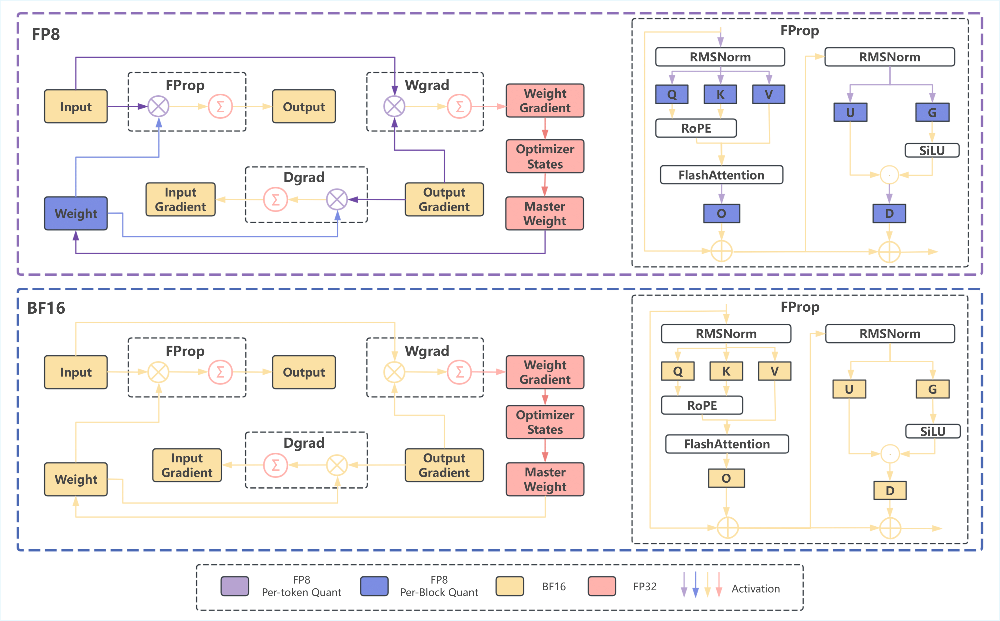

# InfiR2

<p align="center">
  <b>InfiR2: A Comprehensive FP8 Training Recipe for Reasoning-Enhanced Language Models</b>
</p>

<p align="center">
  <a href="https://scholar.google.com/citations?hl=zh-CN&user=1LA3TSAAAAAJ">Wenjun Wang*</a>,
  <a href="https://scholar.google.com/citations?user=VRlUiqQAAAAJ">Shuo Cai*</a>,
  <a href="https://scholar.google.com/citations?user=I6SAtGMAAAAJ&hl=en">Congkai Xie</a>, Mingfa Feng, Yiming Zhang, Zhen Li, Kejing Yang, Ming Li, Jiannong Cao, Hongxia Yang <br>

</p>


<p align="center">
  <a href="https://arxiv.org/abs/2509.22536">📄 Paper</a> &nbsp; | &nbsp;
  <a href="https://huggingface.co/datasets/ZaynZhu/Paper2Video">🤗 Huggingface </a> &nbsp; | &nbsp;
  <a href="https://infix-ai.com/research/infir2/">🌐 Project Website</a> &nbsp; | &nbsp;
</p>


## 🔥 更新

* [x] [2025.10.8] 我们发布了 [代码](https://github.com/InfiXAI/InfiR2) 和 [模型](https://huggingface.co/collections/InfiX-ai/infir2-68edca7ae3c3f052b2db0eed)。
* [x] [2025.9.26] 我们发布了 [arxiv 论文](https://arxiv.org/abs/2509.22536)。

---

### 目录

* [🌟 概述](#-概述)
* [🚀 环境准备](#-环境准备)
* [🤖 FP8 持续预训练](#-FP8_持续预训练)
* [🌈 FP8 监督微调](#-FP8_监督微调)
* [📊 模型评测](#-模型评测)
* [🙏 致谢](#-致谢)
* [📌 引用](#-引用)

---

## 🌟 概述

我们提出了一套端到端的 FP8 训练方案，能够无缝衔接持续预训练（CPT）与监督微调（SFT）阶段。该方法采用细粒度、混合粒度的量化策略，在保持数值精度的同时最大化计算效率。通过在包含 160B token 的语料上进行持续预训练实验，我们验证了该方案具有极高的稳定性与几乎无损的性能表现，在多个推理基准测试上表现与 BF16 基线几乎一致。
更重要的是，FP8 配方在效率上实现了显著提升：**训练时间减少 22%**、**峰值显存降低 14%**、**吞吐量提升 19%**。
我们的研究表明，FP8 是一种实用且稳健的 BF16 替代方案。我们将发布完整代码，以推动大模型训练的普惠化。

<div align="center">
  
</div>

---

## 🚀 环境准备

克隆本仓库：

```bash
git clone --recursive https://github.com/InfiXAI/InfiR2
```

### 环境配置

我们支持通过 **Conda** 和 **Docker** 两种方式进行环境搭建，二者均基于 [THUDM/slime](https://github.com/THUDM/slime) 的官方环境配置。
详细使用说明请参考以下链接。

---

### Docker 环境配置

自定义的 Docker 镜像位于 [Dockerfile.te_fp8.cu129](docker/Dockerfile.te_fp8.cu129)。
使用以下命令构建 Docker：

```bash
docker build --no-cache \
    --file docker/Dockerfile.te_fp8.cu129 \
    --build-arg HTTP_PROXY="$http_proxy" \
    --build-arg HTTPS_PROXY="$https_proxy" \
    --build-arg NO_PROXY="localhost,127.0.0.1" \
    --build-arg SGLANG_VERSION=${SGLANG_VERSION:-v0.5.0rc0-cu129} \
    --build-arg MEGATRON_COMMIT=${MEGATRON_COMMIT:-main} \
    -t infix/te-fp8:cu129 .
```

更多信息请参考 [docker/README.md](docker/README.md)。

---

## 🤖 FP8 持续预训练

我们提供了基于 FP8 量化的持续预训练（CPT）脚本。
该 FP8 训练方案相较于 BF16 基线，**训练时间减少高达 22%**、**峰值显存降低 14%**、**吞吐量提升 19%**，同时保持推理性能不下降。更多详情参见 [docs/Pretrain.md](docs/Pretrain.md)。

### 支持的脚本

我们支持 7B 和 1.5B 两种模型规模的灵活配置：

* **7B 模型**

  * 完整训练流程：[InfiR2_CPT_FP8_7B.sh](scripts/CPT/InfiR2_CPT_FP8_7B.sh)（包含 warmup+stable+decay 三阶段）
  * 单独衰减阶段：[InfiR2_CPT_FP8_7B_decay.sh](scripts/CPT/InfiR2_CPT_FP8_7B_decay.sh)
* **1.5B 模型**

  * 完整训练流程：[InfiR2_CPT_FP8_1.5B.sh](scripts/CPT/InfiR2_CPT_FP8_1.5B.sh)
  * 单独衰减阶段：[InfiR2_CPT_FP8_1.5B_decay.sh](scripts/CPT/InfiR2_CPT_FP8_1.5B_decay.sh)

#### 运行方法

**方式一：完整训练流程（推荐）**

运行完整的 warmup + stable + decay 三阶段训练：

```bash
bash scripts/CPT/InfiR2_CPT_FP8_7B.sh
```

该脚本将自动完成所有阶段的训练。

**方式二：从指定检查点进入衰减阶段（进阶）**

```bash
# 首先找到 stable 阶段的 checkpoint
# 然后运行衰减阶段脚本
bash scripts/CPT/InfiR2_CPT_FP8_7B_decay.sh \
    --load exp/InfiR2_CPT_FP8_7B/checkpoints/iter_0035000
```

---

## 🌈 FP8 监督微调

我们提供基于 FP8 量化的两阶段监督微调（SFT）训练脚本，遵循 [InfiAlign](https://arxiv.org/abs/2508.05496) 的方法。
该训练过程使用 Ray 进行分布式执行，并支持多节点训练。更多详情参见 [docs/SFT.md](docs/SFT.md)。

### 支持的脚本

我们支持 7B 和 1.5B 模型的多阶段训练配置：

* 7B 模型

  * 第一阶段：[InfiR2_SFT_FP8_7B_stage1.sh](scripts/SFT/InfiR2_SFT_FP8_7B_stage1.sh)
  * 第二阶段：[InfiR2_SFT_FP8_7B_stage2.sh](scripts/SFT/InfiR2_SFT_FP8_7B_stage2.sh)
* 1.5B 模型

  * 第一阶段：[InfiR2_SFT_FP8_1.5B_stage1.sh](scripts/SFT/InfiR2_SFT_FP8_1.5B_stage1.sh)
  * 第二阶段：[InfiR2_SFT_FP8_1.5B_stage2.sh](scripts/SFT/InfiR2_SFT_FP8_1.5B_stage2.sh)

#### 参数配置

**数据集路径：**

```bash
DATA_DIR=/path/to/stage1_data
```

**模型路径：**

```bash
HF_CHECKPOINT=/path/to/base_models_hf/qwen2.5-7B/
REF_LOAD=/path/to/base_models_/qwen2.5-7B_torch_dist/
```

#### 运行方法

首先启动 Ray 集群：

```bash
ray start --head --node-ip-address ${MASTER_ADDR} --num-gpus 8 --disable-usage-stats --dashboard-host=0.0.0.0 --dashboard-port=8265
```

然后运行训练脚本：

```bash
bash scripts/SFT/InfiR2_SFT_FP8_7B_stage1.sh
```

---

## 🎯 FP8 强化学习阶段

我们的强化学习（RL）流程包括两个阶段：

1. **压缩回复长度阶段**
2. **扩展回复长度阶段**

在 RL 训练前，需要将 SFT 阶段 2 的模型转换为 FP8 E8M0 格式，以便在 rollout 阶段进行高效推理。
更多细节见 [docs/RL.md](docs/RL.md)。

### 模型转换

```bash
# 第一步：将 PyTorch 分布式权重转为 HuggingFace 格式
PYTHONPATH=training/Megatron-LM:training/slime python tools/convert_torch_dist_to_hf.py \
    --input-dir /path/to/InfiR2_SFT_FP8_stg2 \
    --output-dir /path/to/InfiR2_SFT_FP8_stg2_hf \
    --origin-hf-dir /path/to/models/Qwen2.5-7B

# 第二步：将 BF16 模型转换为 FP8 E8M0 格式
python tools/bf16_cast_fp8.py \
    --input-bf16-hf-path /path/to/InfiR2_SFT_FP8_stg2_hf \
    --output-fp8-hf-path /path/to/InfiR2_SFT_FP8_stg2_hf_e8m0 \
    --force-pow-2-scale True
```

转换后的 FP8 E8M0 模型将在 rollout 阶段使用，大幅提升推理效率。

* 阶段 1：[InfiR2_RL_FP8_7B_stage1_4node.sh](scripts/RL/InfiR2_RL_FP8_7B_stage1_4node.sh)
* 阶段 2：[InfiR2_RL_FP8_7B_stage2_4node.sh](scripts/RL/InfiR2_RL_FP8_7B_stage2_4node.sh)

#### 参数配置

**数据集路径：**

```bash
DATA_DIR=/path/to/data/dapo-math-17k.jsonl
```

**模型路径：**

```bash
HF_CHECKPOINT=/path/to/InfiR2_SFT_FP8_stg2_hf_e8m0/
REF_LOAD=/path/to/InfiR2_SFT_FP8_stg2/
```

#### 运行方法

与 SFT 相同，先启动 Ray，再执行脚本。
该课程式训练策略可确保稳定训练，并在不同回复长度下实现最优性能。

---

## 📊 模型评测

我们基于开源框架 [evalscope](https://github.com/modelscope/evalscope) 进行所有评测，以确保可复现性。
评测覆盖四个推理类基准任务，并提供配套脚本。

### 环境配置

我们验证了模型与最新版 evalscope 的兼容性。
若需严格复现论文结果，请使用以下特定版本：

* 仓库：[evalscope](https://github.com/modelscope/evalscope)
* 分支：`main`
* PR：[Add qwen-code best practice doc #734](https://github.com/modelscope/evalscope/pull/734)

安装方式：

```bash
git clone https://github.com/modelscope/evalscope.git
cd evalscope/
pip install -e .
```

### 评测基准

| 任务            | 脚本                                                              | 最大 Token 数 | 样本数 | 温度   |
| ------------- | --------------------------------------------------------------- | ---------- | --- | ---- |
| AIME 2024     | [aime24_eval.sh](scripts/eval/aime24_eval.sh)                   | 31,000     | 32  | 0.65 |
| AIME 2025     | [aime25_eval.sh](scripts/eval/aime25_eval.sh)                   | 31,000     | 32  | 0.65 |
| GPQA          | [gpqa_eval.sh](scripts/eval/gpqa_eval.sh)                       | 26,000     | 8   | 0.65 |
| LiveCodeBench | [livecodebenchv5_eval.sh](scripts/eval/livecodebenchv5_eval.sh) | 27,000     | 8   | 0.65 |

每个脚本均使用 Slurm 调度任务，并由 SGLang 提供高效推理服务。

---

## 🙏 致谢

我们衷心感谢以下开源项目的支持：
[Slime](https://github.com/THUDM/slime)、[Megatron](https://github.com/NVIDIA/Megatron-LM)、[TransformerEngine](https://github.com/NVIDIA/TransformerEngine)、[Qwen2.5](https://github.com/QwenLM/Qwen2.5-Math)。

---

## 📌 引用

如果您觉得本工作有帮助，请引用以下论文：

```bibtex
@misc{wang2025infir2comprehensivefp8training,
      title={InfiR2: A Comprehensive FP8 Training Recipe for Reasoning-Enhanced Language Models}, 
      author={Wenjun Wang and Shuo Cai and Congkai Xie and Mingfa Feng and Yiming Zhang and Zhen Li and Kejing Yang and Ming Li and Jiannong Cao and Hongxia Yang},
      year={2025},
      eprint={2509.22536},
      archivePrefix={arXiv},
      primaryClass={cs.CL},
      url={https://arxiv.org/abs/2509.22536}, 
}
```
